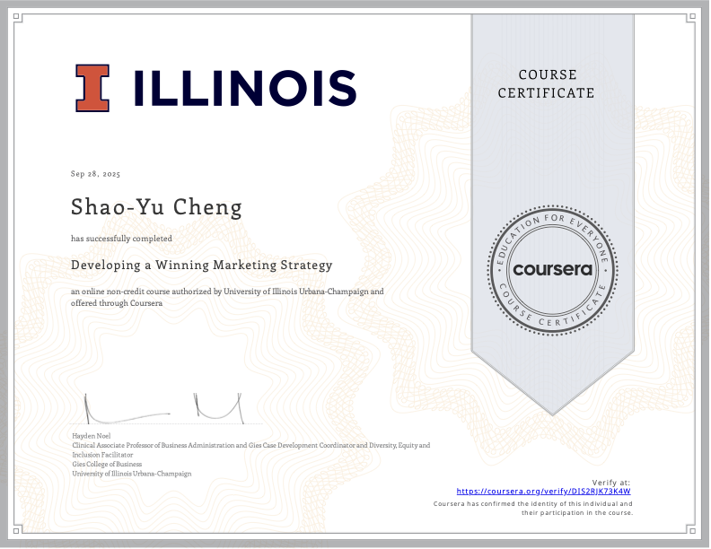
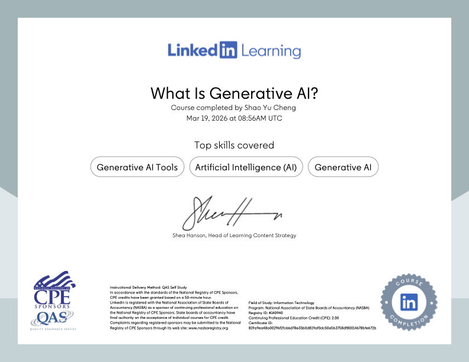

## Hi, I'm Shao Yu Cheng <small>(Charlotte)</small> 👋

A results-oriented **Project Manager** and current **MSTM student at UIUC** (Expected Graduation: Aug 2026), bridging the gap between project leadership and data analytics.

### 💼 Professional Experience
With **5 years of experience in Project Management**, I have developed a strong foundation in driving project success through:
* **Strategic Execution:** Managing complex timelines and ensuring high-quality deliverables.
* **Resource Management:** Expertise in budget oversight and schedule control.
* **Communication Leadership:** Proven ability in cross-functional collaboration and social media strategy to expand customer reach.

### 📈 Why Data?
I believe that the strongest leadership is rooted in **Data-Driven Decision Making**. Currently, I am pursuing my Master’s at **UIUC** to empower my project management background with advanced analytical tools and technical insights.

### 🛠️ Tech Stack
- **Management:** ProjectLibre, MS Project, Agile/Scrum
- **Analytics:** Python (Pandas, Numpy), SQL, Radient
- **Interests:** F1 Data Analysis 🏎️ | Freediving (A2) 🤿
- **Language:** Chinese(Native), English(Fluent)

### 🎓 Additional Certifications
#### Developing a Winning Marketing Strategy
 

#### What Is Generative AI?

